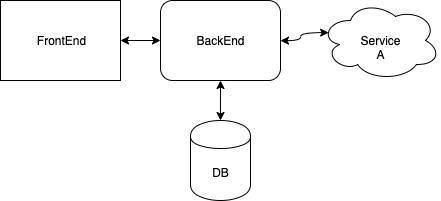

# Тестирование
## Модульные

####  Примечание 
Из задания:
_Если card_holder содержит более одного пробела, то
 тестируемый метод возвращает 400 с сообщением об ошибке_ 

Тут спорно. Это поле может содержать более одного пробела, так как имя может быть состовным. Так же может добавляться префикс (MR, MRS). В качестве удешевления - это поле можно выпилить из формы, так как, насколько я знаю, для банка оно опциональное.

Из задания:
_order_number(номер заказа, до 16 произвольных символов)_

Даже символы переноса строки, пробелы, табуляция или только цифернобуквенные + спецсимволы?

#### Кейсы

##### Общее

##### _card_number_

Получаем 400 и сообщение об ошибке если:

- Количество символов не 16.
- Присутствуют нециферные символы.
- Тип данных не string.

Получаем 200 если:

- Указано 16 цифр 

##### _card_holder_

Получаем 400 и сообщение об ошибке если:

- В поле пристуствуют не буквенные символы латинского алфавита, за исключением пробела и дефиса.
- Тип данных не string.
- Содержимое более 26 символов либо меньше 2.

Получаем 200 если:

- В поле указано BAZAROV ALEKSANDR

##### _card_expiration_

Получаем 400 и сообщение об ошибке если:

- Тип данных не string.
- Содержитмое не соответсвует формату ММ/ГГ.
- Указана несуществующая дата.
- Указана прошедшая дата.

Получаем 200 если:

-Указана корректная дата (сейчас + год вперед).

##### _cvv_ 

Получаем 400 и сообщение об ошибке если:

- Тип данных не string.
- Длинна содержимого не равно 3.
- Содержит не только цифры.

Получаем 200 если:

- Передаем 3 цифры.

##### _order_number_

Получаем 400 и сообщение об ошибке если:

- Тип данных не string.
- Содержимое более 26 символов либо равная 0.
- Содержит спецсимволы либо непечатаемые символы.

Получаем 200 если:

- Передаем набор цифро-буквенных символов длиной от 1 до 26

##### _sum_

Получаем 400 и сообщение об ошибке если:

- Тип данных не string.
- В содержимом нет цифр
- Содержимом нет запятой
- В содержимом присутствуют буквенные символы
- В содержимом присутствуют служебные символы (за исключением запятой)
- Пустое содержимое

Получаем 200 если:

- Передана корретная сумма)

## Интеграционные

##### Frontend - Backend

- Если как минимум одно обязательное поле не заполнено - оно, после отправки формы, выделяется красным и появляется алерт о незаполненом поле.
- Если как минимум одно поле не проходит валидаци - оно, после отправки формы, выделяется красным и появляется алерт о незаполненом неверном формате. 
- При таймауте или ошибки на сервере 500 - отображаем сообщение, что что-то прошло не так, просим повторить позднее.
- При получении от бекенда 403 - показываем сообщение об ошибке.
- При получении 200 - показываем, что все ок

##### Backend - Database

- Ошибка при подключении к БД - падаем с эксепшеном.
- Ошибка при обращении к БД (внутренняя ошибка БД, к примеру duplicate entry) - падаем с эксепшеном.
- БД пуста - падаем с эксепшеном.
- Если метод _setOrderIsPaid_ возвращает false - падаем с эксепшеном.

##### Backend - Service A

- При таймауте или ошибки на стороне сервиса А (500) - бекенд возвращает 500.
- При несовпадении формата ответа сервиса А - бекенд возвращает 500.
- Если сервис А успешно принял запрос но транзакция не прошла (403) - бекенд возвращает 403.
- Если сервис успешно провел транзакцию (200) - бекенд возвращает 200.

## Системные

#### Frontend

- Выводим *предупреждение* если сервис А не смог провести транзакцию (403).
- Выводим *оповещение об ошибке* (500) если:
    - Сервис А не ответил либо вернул 500
    - Произошла ошибка на бекенде.
    - Произошла ошибка при обращении к БД.
- Выводим *оповещение о успехе*, если ошибок не возникло (сервис В вернул 200 и в метод _setOrderIsPaid_ вернул true).

#### Backend

- Если сервис А возвращает 200 - производим запись в БД.
- Если сервис А возвращает (40x, 50x) - данные не записываются в БД.