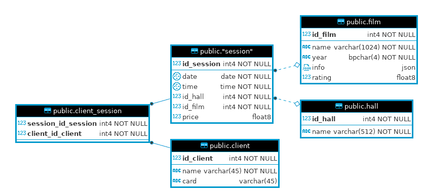

### Спроектировать схему данных для системы управления кинотеатром
* Кинотеатр имеет несколько залов, в каждом зале идет несколько разных сеансов, пользователи могут купить билеты на сеансы
* Спроектировать базу данных, для управления кинотеатром, задокументировать с помощью ER-модели
* Написать DDL скрипты
* (задача со звездочкой, по желанию) Написать SQL для нахождения самого прибыльного фильма
Критерии оценки: Выполнение правил нормализации, наличие ER-модели, можете использовать Visio, Visual Paradigm, MySQL Workbeanch

