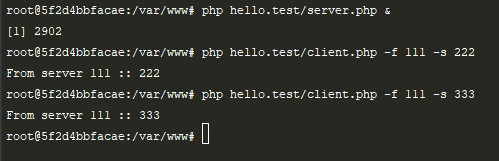

# Тестирование работы сокетов

Два файла, сервер www/hello.test/server.php и клиент www/hello.test/client.php обмениваются сообщениями через сокеты.

Как запустить тест:
1. Запускаем сервер в фоновом режиме `php hello.test/server.php &`
2. Запускаем клиент. В командной строке передаем 2 параметра: -f и -s. Например: 
`php hello.test/client.php -f 111 -s 222`

3. Клиент склеит параметры из массива в строку с разделителем `::`, добавит `From server` для красоты и вернет результат через сокет клиенту.
4. Клиент выведет полученное на экран посредством echo.
5. Выключаться самостоятельно сервер не умеет, ему надо делать kill. Вот такой примитив.

