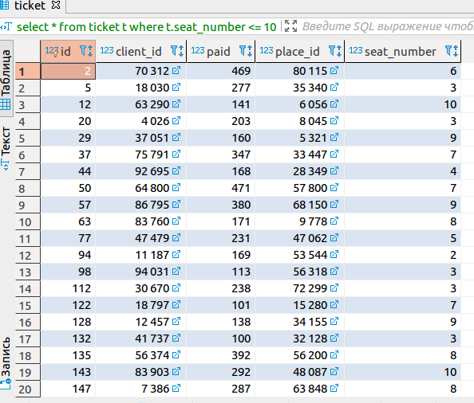
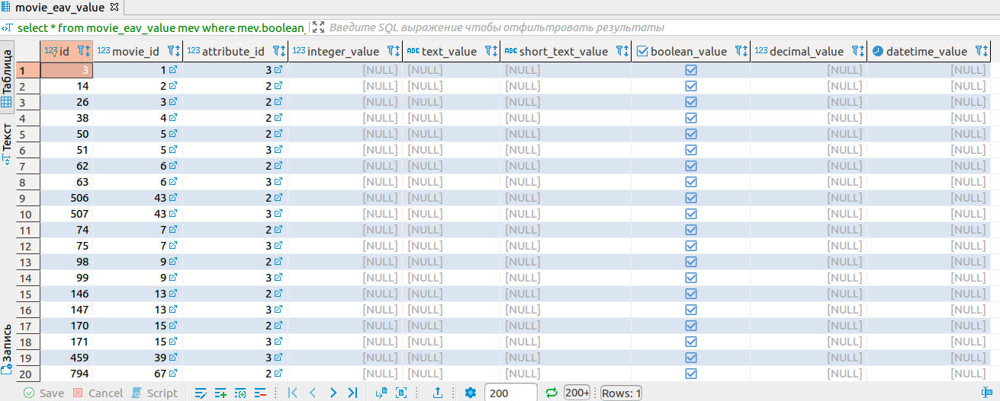
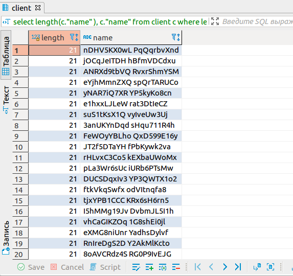
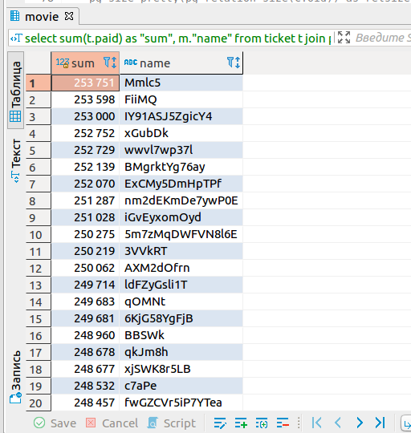
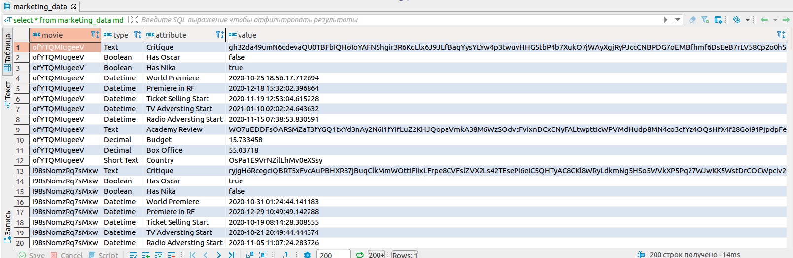
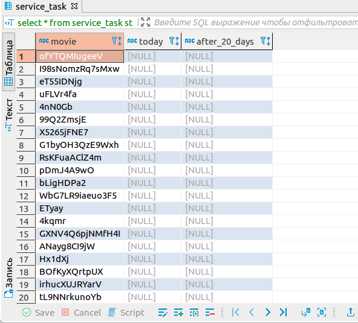
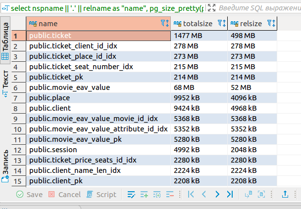
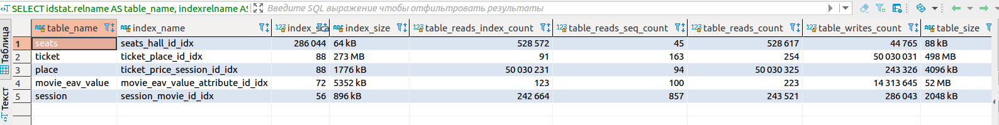
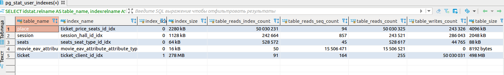

## Отчет по ДЗ
* [Scripts](#scripts)
* [Queries](#queries)  
    * [Query #1](#query-1)  
    * [Query #2](#query-2)  
    * [Query #3](#query-3)  
    * [Query #4](#query-4)  
    * [Query #5](#query-5)  
    * [Query #6](#query-6)  
* [Statistics](#statistics)
* [Optimization](#optimization)

### Scripts
1. Скрипт создания БД ([dll.sql](scripts/ddl.sql))
2. скрипт заполнения БД тестовыми данными ([functions-ddl.sql](scripts/functions-ddl.sql))  
* Для 10 000 записей
```sql
call fill_data(10000);
```
* Для 10 000 000 записей
```sql
call fill_data(10000000);
```

### Queries

#### Query #1
```sql 
select * from ticket t where t.seat_number <= 10;
```
* Результат  

* План 10 000 строк
```
Seq Scan on ticket t  (cost=0.00..189.00 rows=1677 width=19) (actual time=0.020..2.799 rows=1677 loops=1)
    Filter: (seat_number <= 10)
    Rows Removed by Filter: 8323
  Planning Time: 0.081 ms
  Execution Time: 2.971 ms
```
* План 10 000 000 строк
```
Seq Scan on ticket t  (cost=0.00..201435.44 rows=1847926 width=19) (actual time=6.443..1455.115 rows=1665637 loops=1)
  Filter: (seat_number <= 10)
  Rows Removed by Filter: 8334363
Planning Time: 0.087 ms
JIT:
  Functions: 4
  Options: Inlining false, Optimization false, Expressions true, Deforming true
  Timing: Generation 1.134 ms, Inlining 0.000 ms, Optimization 0.522 ms, Emission 5.741 ms, Total 7.397 ms
Execution Time: 1531.810 ms
```

#### Query #2
```sql 
select * from movie_eav_value mev where mev.boolean_value;
```
* Результат  

* План 10 000 строк
```
Seq Scan on movie_eav_value mev  (cost=0.00..9.40 rows=24 width=1051) (actual time=0.015..0.074 rows=24 loops=1)
  Filter: boolean_value
  Rows Removed by Filter: 216
Planning Time: 0.073 ms
Execution Time: 0.097 ms
```
* План 10 000 000 строк
```
Seq Scan on movie_eav_value mev  (cost=0.00..9088.00 rows=20840 width=1063) (actual time=0.033..58.171 rows=20019 loops=1)
  Filter: boolean_value
  Rows Removed by Filter: 219981
Planning Time: 0.084 ms
Execution Time: 59.354 ms
```

#### Query #3
```sql 
select length(c."name" ), c."name" from client c where length(c."name") > 20;
```
* Результат  

* План 10 000 строк
```
Seq Scan on client c  (cost=0.00..2.58 rows=33 width=4) (actual time=0.036..0.041 rows=2 loops=1)
  Filter: (length((name)::text) > 20)
  Rows Removed by Filter: 98
Planning Time: 0.059 ms
Execution Time: 0.060 ms
```
* План 10 000 000 строк
```
Seq Scan on client c  (cost=0.00..2204.33 rows=33333 width=4) (actual time=0.038..22.176 rows=1577 loops=1)
  Filter: (length((name)::text) > 20)
  Rows Removed by Filter: 98423
Planning Time: 0.064 ms
Execution Time: 22.312 ms
```

#### Query #4
```sql 
select sum(t.paid) as "sum", m."name" from ticket t
join place p on p.id = t.place_id 
join "session" s on s.id = p.session_id 
join movie m on m.id = s.movie_id 
group by m.id
order by "sum" desc;
```
* Результат  

* План 10 000 строк
```
Sort  (cost=480.19..484.71 rows=1810 width=49) (actual time=10.884..10.885 rows=20 loops=1)
  Sort Key: (sum(t.paid)) DESC
  Sort Method: quicksort  Memory: 26kB
  ->  HashAggregate  (cost=359.63..382.25 rows=1810 width=49) (actual time=10.837..10.864 rows=20 loops=1)
        Group Key: m.id
        ->  Hash Join  (cost=8.13..309.63 rows=10000 width=22) (actual time=0.430..6.976 rows=10000 loops=1)
              Hash Cond: (t.place_id = p.id)
              ->  Seq Scan on ticket t  (cost=0.00..164.00 rows=10000 width=9) (actual time=0.016..2.596 rows=10000 loops=1)
              ->  Hash  (cost=7.03..7.03 rows=88 width=21) (actual time=0.403..0.403 rows=88 loops=1)
                    Buckets: 1024  Batches: 1  Memory Usage: 13kB
                    ->  Merge Join  (cost=5.03..7.03 rows=88 width=21) (actual time=0.079..0.356 rows=88 loops=1)
                          Merge Cond: (s.id = p.session_id)
                          ->  Nested Loop  (cost=0.30..396.56 rows=1770 width=21) (actual time=0.016..0.215 rows=44 loops=1)
                                ->  Index Scan using session_pk on session s  (cost=0.15..47.70 rows=1770 width=8) (actual time=0.007..0.042 rows=44 loops=1)
                                ->  Index Scan using movie_pk on movie m  (cost=0.15..0.20 rows=1 width=17) (actual time=0.003..0.003 rows=1 loops=44)
                                      Index Cond: (id = s.movie_id)
                          ->  Sort  (cost=4.72..4.94 rows=88 width=8) (actual time=0.057..0.071 rows=88 loops=1)
                                Sort Key: p.session_id
                                Sort Method: quicksort  Memory: 29kB
                                ->  Seq Scan on place p  (cost=0.00..1.88 rows=88 width=8) (actual time=0.007..0.027 rows=88 loops=1)
Planning Time: 0.810 ms
Execution Time: 10.981 ms
```
* План 10 000 000 строк
```
Sort  (cost=213699.12..213749.12 rows=20000 width=49) (actual time=9173.718..9176.640 rows=20000 loops=1)
  Sort Key: (sum(t.paid)) DESC
  Sort Method: quicksort  Memory: 2331kB
  ->  Finalize GroupAggregate  (cost=207053.36..212270.35 rows=20000 width=49) (actual time=9084.769..9160.740 rows=20000 loops=1)
        Group Key: m.id
        ->  Gather Merge  (cost=207053.36..211720.35 rows=40000 width=49) (actual time=9084.731..9105.015 rows=60000 loops=1)
              Workers Planned: 2
              Workers Launched: 2
              ->  Sort  (cost=206053.33..206103.33 rows=20000 width=49) (actual time=8938.645..8942.859 rows=20000 loops=3)
                    Sort Key: m.id
                    Sort Method: quicksort  Memory: 3398kB
                    Worker 0:  Sort Method: quicksort  Memory: 3398kB
                    Worker 1:  Sort Method: quicksort  Memory: 3398kB
                    ->  Partial HashAggregate  (cost=204374.56..204624.56 rows=20000 width=49) (actual time=8913.224..8928.468 rows=20000 loops=3)
                          Group Key: m.id
                          ->  Hash Join  (cost=4361.24..183541.50 rows=4166613 width=22) (actual time=90.362..6914.174 rows=3333333 loops=3)
                                Hash Cond: (s.movie_id = m.id)
                                ->  Hash Join  (cost=3783.24..172023.82 rows=4166613 width=9) (actual time=54.920..5175.082 rows=3333333 loops=3)
                                      Hash Cond: (p.session_id = s.id)
                                      ->  Hash Join  (cost=2626.16..159928.23 rows=4166613 width=9) (actual time=37.248..3434.603 rows=3333333 loops=3)
                                            Hash Cond: (t.place_id = p.id)
                                            ->  Parallel Seq Scan on ticket t  (cost=0.00..105361.13 rows=4166613 width=9) (actual time=0.060..858.604 rows=3333333 loops=3)
                                            ->  Hash  (cost=1311.96..1311.96 rows=80096 width=8) (actual time=36.467..36.468 rows=80096 loops=3)
                                                  Buckets: 131072  Batches: 2  Memory Usage: 2590kB
                                                  ->  Seq Scan on place p  (cost=0.00..1311.96 rows=80096 width=8) (actual time=0.024..15.060 rows=80096 loops=3)
                                      ->  Hash  (cost=656.48..656.48 rows=40048 width=8) (actual time=17.374..17.374 rows=40048 loops=3)
                                            Buckets: 65536  Batches: 1  Memory Usage: 2077kB
                                            ->  Seq Scan on session s  (cost=0.00..656.48 rows=40048 width=8) (actual time=0.041..7.415 rows=40048 loops=3)
                                ->  Hash  (cost=328.00..328.00 rows=20000 width=17) (actual time=35.280..35.280 rows=20000 loops=3)
                                      Buckets: 32768  Batches: 1  Memory Usage: 1272kB
                                      ->  Seq Scan on movie m  (cost=0.00..328.00 rows=20000 width=17) (actual time=25.744..29.786 rows=20000 loops=3)
Planning Time: 9.792 ms
JIT:
  Functions: 96
  Options: Inlining false, Optimization false, Expressions true, Deforming true
  Timing: Generation 13.829 ms, Inlining 0.000 ms, Optimization 2.975 ms, Emission 73.380 ms, Total 90.185 ms
Execution Time: 9187.205 ms
```
#### Query #5
```sql 
select * from marketing_data md ;
```
* Результат  

* План 10 000 строк
```
Hash Join  (cost=21.45..34.86 rows=240 width=66) (actual time=0.262..0.791 rows=240 loops=1)
  Hash Cond: (mea.attribute_type_id = meat.id)
  ->  Hash Join  (cost=20.31..24.85 rows=240 width=1069) (actual time=0.238..0.550 rows=240 loops=1)
        Hash Cond: (mev.attribute_id = mea.id)
        ->  Merge Join  (cost=19.04..22.73 rows=240 width=1056) (actual time=0.221..0.403 rows=240 loops=1)
              Merge Cond: (m.id = mev.movie_id)
              ->  Index Scan using movie_pk on movie m  (cost=0.15..48.30 rows=1810 width=17) (actual time=0.004..0.017 rows=20 loops=1)
              ->  Sort  (cost=18.89..19.49 rows=240 width=1047) (actual time=0.211..0.244 rows=240 loops=1)
                    Sort Key: mev.movie_id
                    Sort Method: quicksort  Memory: 96kB
                    ->  Seq Scan on movie_eav_value mev  (cost=0.00..9.40 rows=240 width=1047) (actual time=0.005..0.095 rows=240 loops=1)
        ->  Hash  (cost=1.12..1.12 rows=12 width=17) (actual time=0.011..0.011 rows=12 loops=1)
              Buckets: 1024  Batches: 1  Memory Usage: 9kB
              ->  Seq Scan on movie_eav_attribute mea  (cost=0.00..1.12 rows=12 width=17) (actual time=0.003..0.006 rows=12 loops=1)
  ->  Hash  (cost=1.06..1.06 rows=6 width=10) (actual time=0.014..0.015 rows=6 loops=1)
        Buckets: 1024  Batches: 1  Memory Usage: 9kB
        ->  Seq Scan on movie_eav_attribute_type meat  (cost=0.00..1.06 rows=6 width=10) (actual time=0.007..0.009 rows=6 loops=1)
Planning Time: 0.674 ms
Execution Time: 0.877 ms
```
* План 10 000 000 строк
```
Hash Join  (cost=580.40..20005.04 rows=240000 width=66) (actual time=9.059..366.178 rows=240000 loops=1)
  Hash Cond: (mea.attribute_type_id = meat.id)
  ->  Hash Join  (cost=579.27..11128.90 rows=240000 width=1066) (actual time=9.026..246.904 rows=240000 loops=1)
        Hash Cond: (mev.attribute_id = mea.id)
        ->  Hash Join  (cost=578.00..10275.13 rows=240000 width=1053) (actual time=9.004..171.912 rows=240000 loops=1)
              Hash Cond: (mev.movie_id = m.id)
              ->  Seq Scan on movie_eav_value mev  (cost=0.00..9067.00 rows=240000 width=1044) (actual time=0.008..88.250 rows=240000 loops=1)
              ->  Hash  (cost=328.00..328.00 rows=20000 width=17) (actual time=8.938..8.938 rows=20000 loops=1)
                    Buckets: 32768  Batches: 1  Memory Usage: 1272kB
                    ->  Seq Scan on movie m  (cost=0.00..328.00 rows=20000 width=17) (actual time=0.011..3.895 rows=20000 loops=1)
        ->  Hash  (cost=1.12..1.12 rows=12 width=17) (actual time=0.015..0.015 rows=12 loops=1)
              Buckets: 1024  Batches: 1  Memory Usage: 9kB
              ->  Seq Scan on movie_eav_attribute mea  (cost=0.00..1.12 rows=12 width=17) (actual time=0.004..0.008 rows=12 loops=1)
  ->  Hash  (cost=1.06..1.06 rows=6 width=10) (actual time=0.021..0.021 rows=6 loops=1)
        Buckets: 1024  Batches: 1  Memory Usage: 9kB
        ->  Seq Scan on movie_eav_attribute_type meat  (cost=0.00..1.06 rows=6 width=10) (actual time=0.011..0.014 rows=6 loops=1)
Planning Time: 5.283 ms
Execution Time: 378.399 ms
```
#### Query #6
```sql 
explain analyze select * from service_task st ;
```
* Результат  

* План 10 000 строк
```
Subquery Scan on st  (cost=14.94..21.28 rows=100 width=96) (actual time=0.398..0.725 rows=20 loops=1)
  ->  GroupAggregate  (cost=14.94..20.28 rows=100 width=100) (actual time=0.397..0.716 rows=20 loops=1)
        Group Key: m.id
        ->  Merge Join  (cost=14.94..16.53 rows=100 width=38) (actual time=0.359..0.486 rows=100 loops=1)
              Merge Cond: (m.id = mev.movie_id)
              ->  Index Scan using movie_pk on movie m  (cost=0.15..48.30 rows=1810 width=17) (actual time=0.008..0.028 rows=20 loops=1)
              ->  Sort  (cost=14.79..15.04 rows=100 width=25) (actual time=0.345..0.368 rows=100 loops=1)
                    Sort Key: mev.movie_id
                    Sort Method: quicksort  Memory: 32kB
                    ->  Hash Join  (cost=1.21..11.46 rows=100 width=25) (actual time=0.043..0.282 rows=100 loops=1)
                          Hash Cond: (mev.attribute_id = mea.id)
                          ->  Seq Scan on movie_eav_value mev  (cost=0.00..9.40 rows=240 width=14) (actual time=0.011..0.147 rows=240 loops=1)
                          ->  Hash  (cost=1.15..1.15 rows=5 width=15) (actual time=0.018..0.018 rows=5 loops=1)
                                Buckets: 1024  Batches: 1  Memory Usage: 9kB
                                ->  Seq Scan on movie_eav_attribute mea  (cost=0.00..1.15 rows=5 width=15) (actual time=0.007..0.011 rows=5 loops=1)
                                      Filter: (attribute_type_id = 3)
                                      Rows Removed by Filter: 7
Planning Time: 0.724 ms
Execution Time: 0.827 ms
```
* План 10 000 000 строк
```
Subquery Scan on st  (cost=21803.09..24803.09 rows=20000 width=96) (actual time=182.058..273.919 rows=20000 loops=1)
  ->  GroupAggregate  (cost=21803.09..24603.09 rows=20000 width=100) (actual time=182.056..271.392 rows=20000 loops=1)
        Group Key: m.id
        ->  Sort  (cost=21803.09..22053.09 rows=100000 width=38) (actual time=182.031..198.441 rows=100000 loops=1)
              Sort Key: m.id
              Sort Method: external merge  Disk: 5984kB
              ->  Hash Join  (cost=579.21..10761.27 rows=100000 width=38) (actual time=10.808..148.152 rows=100000 loops=1)
                    Hash Cond: (mev.movie_id = m.id)
                    ->  Hash Join  (cost=1.21..9920.71 rows=100000 width=25) (actual time=0.041..109.355 rows=100000 loops=1)
                          Hash Cond: (mev.attribute_id = mea.id)
                          ->  Seq Scan on movie_eav_value mev  (cost=0.00..9067.00 rows=240000 width=14) (actual time=0.012..70.496 rows=240000 loops=1)
                          ->  Hash  (cost=1.15..1.15 rows=5 width=15) (actual time=0.015..0.016 rows=5 loops=1)
                                Buckets: 1024  Batches: 1  Memory Usage: 9kB
                                ->  Seq Scan on movie_eav_attribute mea  (cost=0.00..1.15 rows=5 width=15) (actual time=0.006..0.009 rows=5 loops=1)
                                      Filter: (attribute_type_id = 3)
                                      Rows Removed by Filter: 7
                    ->  Hash  (cost=328.00..328.00 rows=20000 width=17) (actual time=10.697..10.697 rows=20000 loops=1)
                          Buckets: 32768  Batches: 1  Memory Usage: 1272kB
                          ->  Seq Scan on movie m  (cost=0.00..328.00 rows=20000 width=17) (actual time=0.010..5.097 rows=20000 loops=1)
Planning Time: 0.889 ms
Execution Time: 276.405 ms
```

### Statistics
* Список самых больших по размеру объектов БД  

* Список самых часто используемых индексов  

* Список редко используемых индексов  


### Optimization
* Оптимизируем запрос #1
```sql 
select * from ticket t where t.seat_number <= 10;
```
Выборка идет по полю `seat_number`. `Analyze ` показывает, что происходит последовательный поиск.  
Добавим простой индекс на это поле:
```sql 
CREATE INDEX ticket_seat_number_idx ON public.ticket (seat_number);
```
В результате получаем ускорение выборки за счет `Bitmap Index Scan`, но и довольно большой индекс (`215 MB`) 
```
Bitmap Heap Scan on ticket t  (cost=30768.52..114992.68 rows=1642333 width=19) (actual time=186.330..899.914 rows=1665637 loops=1)
  Recheck Cond: (seat_number <= 10)
  Heap Blocks: exact=63695
  ->  Bitmap Index Scan on ticket_seat_number_idx  (cost=0.00..30357.93 rows=1642333 width=0) (actual time=167.439..167.439 rows=1665637 loops=1)
        Index Cond: (seat_number <= 10)
Planning Time: 0.117 ms
JIT:
  Functions: 4
  Options: Inlining false, Optimization false, Expressions true, Deforming true
  Timing: Generation 0.992 ms, Inlining 0.000 ms, Optimization 0.333 ms, Emission 3.740 ms, Total 5.065 ms
Execution Time: 974.790 ms
```
* Оптимизируем запрос #2
```sql 
select * from movie_eav_value mev where mev.boolean_value;
```
Т.к. на интересуют значения `boolean_value` равные `true`. Добавим частичный индекс:
```sql 
CREATE INDEX movie_eav_value_boolean_value_true_idx ON public.movie_eav_value using btree (boolean_value) where boolean_value = true;
```
Получаем ускорение запроса и не большой по размеру индекс (`456 kB`)
```
CREATE INDEX movie_eav_value_boolean_value_true_idx ON public.movie_eav_value using btree (boolean_value) where boolean_value = true;
Bitmap Heap Scan on movie_eav_value mev  (cost=333.59..7229.99 rows=20840 width=1063) (actual time=3.468..16.059 rows=20019 loops=1)
  Recheck Cond: boolean_value
  Heap Blocks: exact=6549
  ->  Bitmap Index Scan on movie_eav_value_boolean_value_true_idx  (cost=0.00..328.38 rows=20840 width=0) (actual time=2.191..2.191 rows=20019 loops=1)
Planning Time: 0.095 ms
Execution Time: 17.214 ms
```
* Оптимизируем запрос #3
```sql 
select length(c."name" ) from client c where length(c."name") > 20;
```
В запросе используется функция `length()`, поэтому добавим функциональный индекс на поле `name` для ускорения этой выборки:
```sql 
CREATE INDEX client_name_len_idx ON public.client using btree (length("name"));
```
Получаем не большой индекс (`2224 kB`) и ускорение выполненяи запроса примерно в 10 раз:
```
Bitmap Heap Scan on client c  (cost=630.75..1835.08 rows=33333 width=4) (actual time=0.259..1.638 rows=1577 loops=1)
  Recheck Cond: (length((name)::text) > 20)
  Heap Blocks: exact=574
  ->  Bitmap Index Scan on client_name_len_idx  (cost=0.00..622.41 rows=33333 width=0) (actual time=0.179..0.180 rows=1577 loops=1)
        Index Cond: (length((name)::text) > 20)
Planning Time: 0.092 ms
Execution Time: 1.761 ms
```