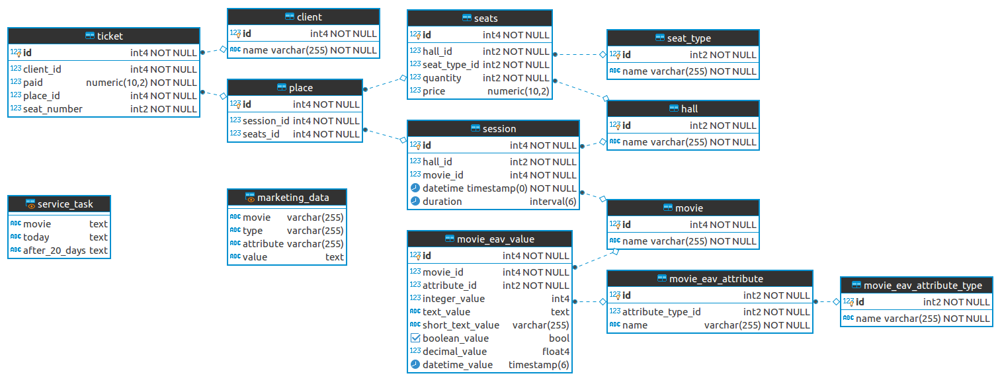

### Исправления
> 1. У каждого места хранится цена. При этом в реальных кинотеатрах используются типы мест, а не отдельная цена на каждое место. Как вывод, мы нарушаем третью нормальную форму

Внес исправления в схему, теперь цена задается в таблице `seats`:
```sql
ALTER TABLE public.seats ADD price numeric(10,2) NULL;
ALTER TABLE public.place DROP COLUMN price;
```

> 2. session имеет тип date. А время начала?

В `session` колонка `date` имеет тип `timestamp`, переименовал эту колонку в `datetime`, чтобы не было путаницы.  

```sql
ALTER TABLE public."session" RENAME COLUMN "date" TO datetime;
```
> 3. Как понять, что два фильма не наложатся один на другой в расписании при его составлении?

Добавил колонку duration и добавил триггер, который будет срабатывать при обновлении/добавлении записи и проверять занят ли зал в указанное время

```sql
ALTER TABLE public."session" ADD duration interval NULL;

CREATE OR REPLACE FUNCTION public.movies_overlay_check()
	RETURNS trigger
	LANGUAGE plpgsql
AS $function$
DECLARE
        found integer;
BEGIN
    IF NEW.hall_id IS null or NEW.datetime IS null  THEN
        RETURN NEW;
    END IF;

    found := array_length(array(select s.id from "session" s 
			where duration is not null 
			and hall_id = NEW.hall_id
			and NEW.datetime between datetime and (s.datetime + s.duration)));
		
    IF found > 0 THEN
            RAISE EXCEPTION 'This movie datetime cannot overlay anocher movie';
    END IF;
RETURN NEW;
END;
$function$
;


CREATE TRIGGER trigger_movies_overlay_check
    BEFORE INSERT OR UPDATE
    ON public."session" FOR EACH ROW
    EXECUTE PROCEDURE movies_overlay_check();
```

Пример ошибки, после вставки записи в `session`, если зал в это время занят


### ER модель


### DDL
Файл `cinema-ddl-eav.sql`

### Задачи
> View сборки служебных данных в форме (три колонки)
```
CREATE OR REPLACE VIEW public.service_task
AS SELECT max(m.name::text) AS movie,
    string_agg(
        CASE
            WHEN mev.datetime_value = CURRENT_DATE THEN mea.name
            ELSE NULL::character varying
        END::text, ', '::text) AS today,
    string_agg(
        CASE
            WHEN mev.datetime_value = (CURRENT_DATE + '20 days'::interval) THEN mea.name
            ELSE NULL::character varying
        END::text, ', '::text) AS after_20_days
   FROM movie m
     JOIN movie_eav_value mev ON mev.movie_id = m.id
     JOIN movie_eav_attribute mea ON mea.id = mev.attribute_id
  WHERE mea.attribute_type_id = 3
  GROUP BY m.id;
```
Результат с данными фыйл `otus_12_view1_data.png`
> View сборки данных для маркетинга в форме (три колонки)
```
CREATE OR REPLACE VIEW public.marketing_data
AS SELECT m.name AS movie,
    meat.name AS type,
    mea.name AS attribute,
        CASE
            WHEN mea.attribute_type_id = 1 THEN mev."integer_value"::text
            WHEN mea.attribute_type_id = 2 THEN mev.text_value
            WHEN mea.attribute_type_id = 3 THEN mev.datetime_value::text
            WHEN mea.attribute_type_id = 4 THEN mev."short_text_value"::text
            WHEN mea.attribute_type_id = 5 THEN mev.boolean_value::text
            WHEN mea.attribute_type_id = 6 THEN mev."decimal_value"::text
            ELSE NULL::text
        END AS value
   FROM movie m
     JOIN movie_eav_value mev ON mev.movie_id = m.id
     JOIN movie_eav_attribute mea ON mea.id = mev.attribute_id
     JOIN movie_eav_attribute_type meat ON meat.id = mea.attribute_type_id;
```
Результат с данными фыйл `otus_12_view2_data.png`