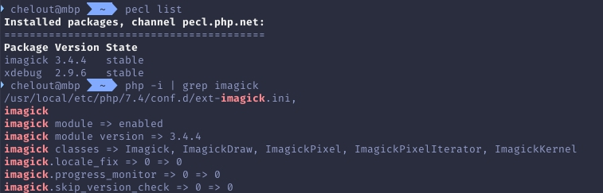
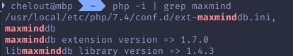

## 1. Необходимо установить любое расширение через pecl и через make (xdebug, redis)
- прислать скриншот команды pecl list, где должно значиться расширение + вывод функции `php -i | grep "ваше расширение"`

- прислать вывод команды make, т.е. `make > make_output.txt` + вывод функции `php -i | grep "ваше расширение"`

`make_output.txt` приложен к PR

## 2. Необходимо создать свой пакет, и выложить в git и/или на packagist.org
- `git clone https://github.com/chelout/laravel-relationship-events`
- `composer require chelout/laravel-relationship-events`

## 3. Создать Docker-образ для работы
`Dockerfile` приложен к PR
