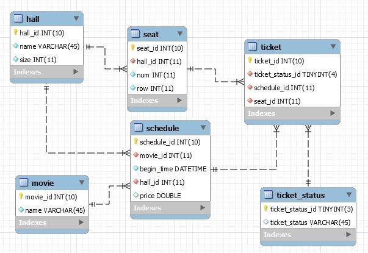

# Cinema DB

### Installing

* use `config/cinema_schema_dump.sql` file to create cinema schema from SQL dump

### Adding new film

1. Add new film name into `movie` table
2. Add schedule and price for new film_id into table `schedule`
3. Run `config/fill_ticket_when_new_movie_scheduled.sql` to generate tickets for specified new schedule_id

### Show schedule, tickets & best film profit

* SQL returns films with best profit: `show/show_best_film_profit.sql`
* SQL returns schedule: `show/show_schedule.sql`
* SQL returns tickets: `show/show_tickets.sql`

### Configuration

* file `config/fill_seat_table.sql` contains SQL example for adding seats layout into 'seat' table if new hall appears in the cinema.
* file `config/fill_ticket_when_new_movie_scheduled.sql` contains SQL example for generating new tickets when new schedule appears.
 
### ER-model

