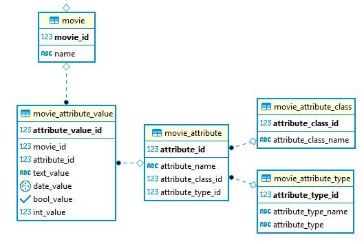

# PostgreSQL for Developer

### Task

Apply Entity-Attribute-Value approach to describe movie properties

### Installing

Use `dump_cinema.sql` to restore DB from dump.
Or see files below.

* file `eav_tables.sql` - SQL for EAV tables
* file `eav_views.sql` - SQL for EAV views

### ER-model

