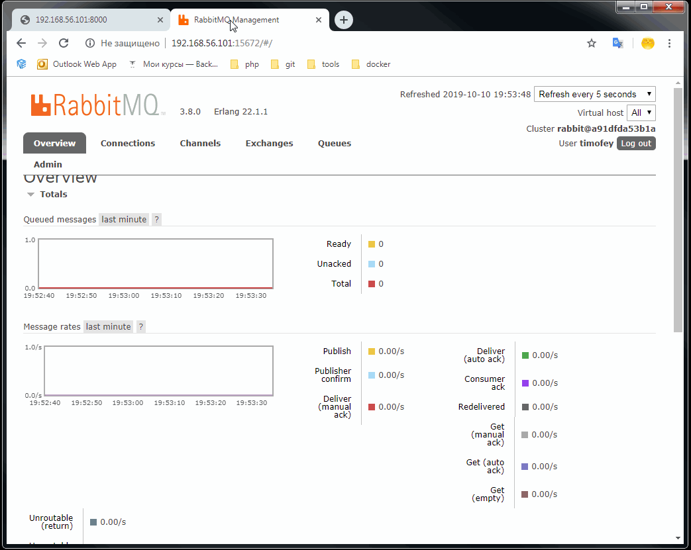

### Mini app with RabbitMQ 

##### Installing
* docker-compose up -d
* http port = 8000
* RabbitMQ GIU port = 15672
	* user: timofey
	* password: timofey123

##### Example
* `Enter your value` - enter number of seconds your request will be executing
* `Enter Request ID` - enter ID of one of your previous request to check status
