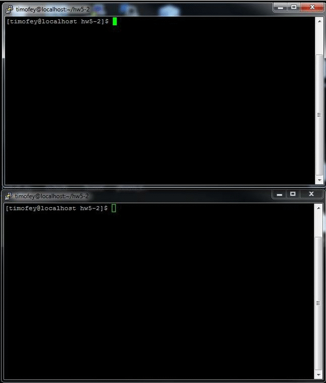

# Linux sockets with PHP

Two PHP scripts send messages via Linux sockets

### Installing

Copy TimGa/hw5-1 folder from GIT

### Example

Run server and client scripts in parallel

* for server run `php server.php`
* for client run `php client.php`
* on client write message to the server
* press enter to send message

After message sent from client, you would get response back from the server.

