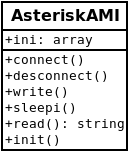
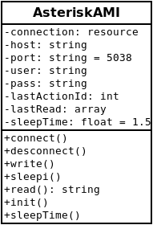

# Анализ кода

Для анализа взял свой проект для работы с Asterisk через AMI-интерфейс.

## До рефакторинга

Проект состоит из двух частей: класс подключения через AMI-интерфейс и демон, в цикле случающий сообщения.
[Исходная версия](old)

## Анализ

- Параметры инициализации передаются через конструктор, но не проверяется их тип. Сохраняются в один публичный массив, который можно изменить и тем самым нарушить работу класса.
- Ресурс открытого сокета, так же сохраняется в публичный массив.
- При отправке сообщения, не проверяется тип.
- Нет возможности регулирования задержки между сообщениями
- Нет контроля ошибок при отправке/приеме сообщения

## После рефакторинга

Исходный код в каталоге [new](new)

- во всех методах, которые имеют входные параметры добавлена проверка типов значений;
- публичный аттрибут `ini` преобразован во множество приватных;
- заменены конструкции `die` и `exit` на `throw new Exception`

