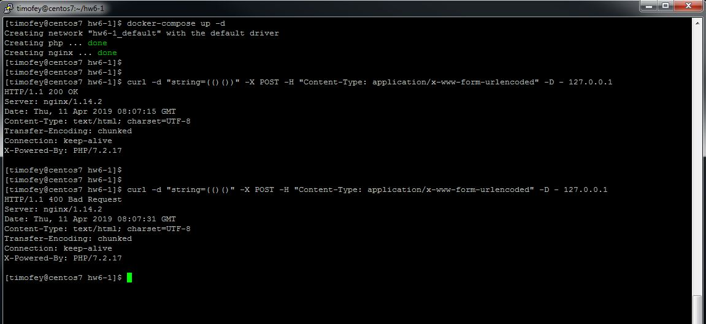

# PHP WebServers

Nginx+PHP-FPM stack based on Docker compose

### Example

* Launch docker containers with docker-compose: 

    ```docker-compose up -d```

* To check string use curl:

    ```curl -d "string=(()())" -X POST -H "Content-Type: application/x-www-form-urlencoded" -D - 127.0.0.1```

If brackets in your POST string is correct you will get response code 200, else code will be 400:
  
