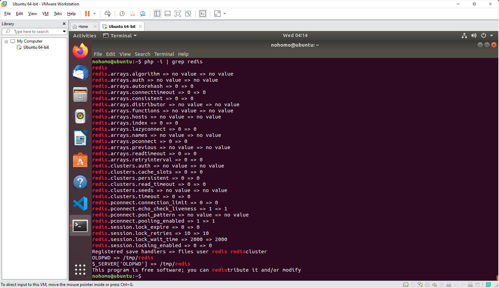
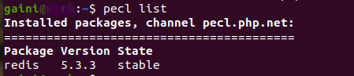

# Логи по установке находятся в файлах:
    - redis_intall_log.txt
    - xdebug_intall_log.txt

### Вывод комманды grep и pecl list на скринах:

### Вывод комманды grep и make в файлах:
    - grep_output.txt
    - make_output.txt