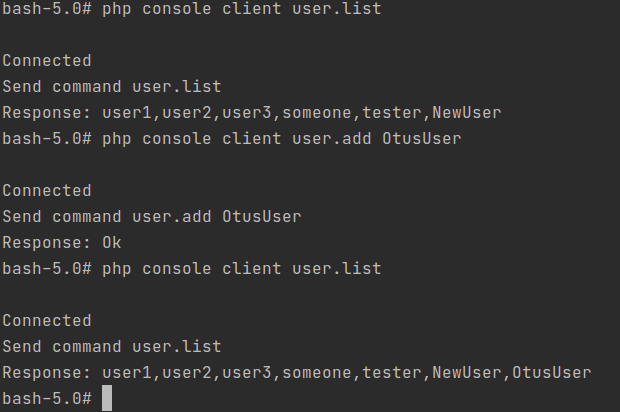

### Запуск
1. `docker-compose up -d`

### Использование
* Вход на контейнер сервера `docker exec -it sockets_php-server_1 bash`
* Вход на контейнер клиента `docker exec -it sockets_php-client_1 bash`
* Запуск сервера `php console server`
* Выполнение команды на клиенте `php console clinet [command] [?parameter]`

### Поддерживаемые команды
* `user.list` - список пользователей
* `user.add [userName]` - добавление юзера в список

### Пример работы
